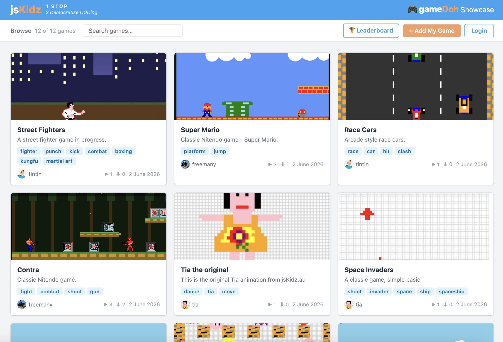
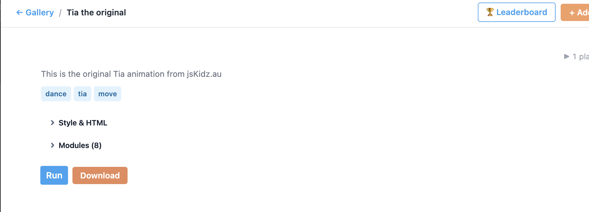
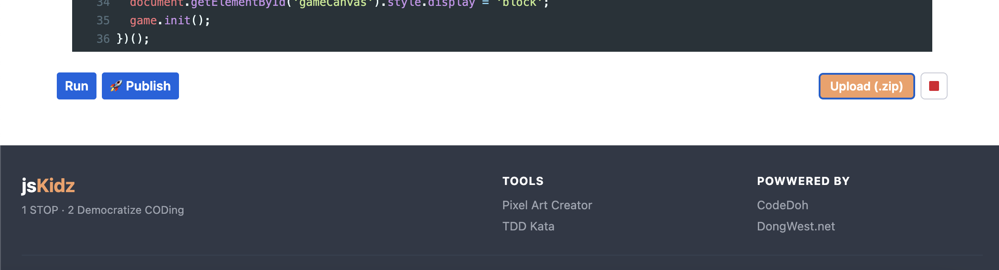

# gamedoh

A collection of browser-based games built with **vanilla JavaScript and HTML5 Canvas**, powered by the **gamedoh engine** — a lightweight, pattern-driven framework for building pixel-art games.

No build tools. No npm install. No frameworks. Just open a browser and play, or open a text editor and build.

---

## Play the Games

| Game | Complexity | Concepts |
|------|-----------|---------|
| [Tia](games/tia/index.html) | Beginner | Sprites, movement, basic input |
| [Searching Carrot](games/searching-carrot/index.html) | Beginner | Camera, world navigation, collectibles |
| [Doodle Jump](games/doodle-jump/index.html) | Beginner | Gravity, platforms, scrolling |
| [Space Invaders](games/spaceinvaders/index.html) | Intermediate | Shooting, alien formations, shields |
| [Pac-Man](games/pacman/index.html) | Intermediate | Maze, ghost AI, power-ups |
| [Tetris](games/tetris/index.html) | Intermediate | Rotation, line clearing, speed progression |
| [Offline Dino](games/offline-dino/index.html) | Intermediate | Obstacles, speed ramp, lives |
| [Race Car](games/race-car/index.html) | Intermediate | Scrolling terrain, opponent AI |
| [Street Fighters](games/street-fighters/index.html) | Intermediate | State machine, animation, combat |
| [Super Mario](games/super-mario/index.html) | Advanced | Tilemap, physics, level design |
| [Contra](games/contra/index.html) | Advanced | Multi-level platformer, weapons, enemies |
| [Breakout](games/breakout/index.html) | Intermediate | ball, bouncing |
| [Bomberman](games/bomberman/index.html) | Advanced | maze, explosive, enemies |

> **Try it live on Github page**: [freemany.github.io/gamedoh](https://freemany.github.io/gamedoh) — hosted demos for the games in repo.
> **Play games on the Showcase**: [gamedoh.jskidz.au](https://gamedoh.jskidz.au) — Play and download games and Upload your own to show off.

---

## Quick Start

```bash
# 1. Clone the repo
git clone https://github.com/freemany/gamedoh.git
cd gamedoh

# 2. Start a local server (required for ES modules)
npx serve .
# — or, if you use VS Code, install the Live Server extension
#   then right-click index.html → "Open with Live Server"

# 3. Open the game gallery to browse and play all games locally
# http://localhost:3000/index.html
```

That's it. No install step.

### The full loop

1. **Browse** — open `index.html` locally to see all the demo games
2. **Play others' games** — visit [gamedoh.jskidz.au](https://gamedoh.jskidz.au) to play and download community games
3. **Download any game** — grab the source, run it locally, and start modifying it
4. **Extend and improve** — add levels, new mechanics, better art — make it your own
5. **Upload back** — share your improved version on the showcase at [gamedoh.jskidz.au](https://gamedoh.jskidz.au) for others to play and learn from

---

## The gameDoh Showcase Platform

[gamedoh.jskidz.au](https://gamedoh.jskidz.au) is the online showcase where the community shares, plays, and downloads gamedoh games.



### Playing and downloading a game

Browse the gallery, open any game, and hit **Run** to play it instantly in your browser. Hit **Download** to grab the full source code as a zip — unzip it, run `npx serve .` locally, and you have the game running on your machine ready to modify.



### Uploading your game

Built something? Zip your game folder and upload it to the showcase so others can play and download it.

1. **Create an account** at [gamedoh.jskidz.au](https://gamedoh.jskidz.au) — required to upload
2. Click **+ Add My Game** in the header
3. Fill in the title, description, and tags
4. Upload your game as a `.zip` file and hit **🚀 Publish**



Once published, your game appears in the gallery for anyone to play, download, extend, and build on.

---

## Build Your First Game

Start with the **starter-kit** — a minimal, fully-wired game template:

```
games/starter-kit/
├── index.html         # Canvas + audio tags
├── main.js            # Entry point: set up entities, callbacks, start
├── game.js            # Extends BaseGame: update loop, drawing, HUD
├── constants.js       # All magic numbers live here
├── gamedoh-engine.js  # Local re-export of the framework
└── CLAUDE.md          # Full architecture guide for this template
```

Read `games/starter-kit/CLAUDE.md` for a complete walkthrough of every pattern: game loop, sprites, state machines, levels, input, audio, collision, camera, and more.

Or follow the [step-by-step tutorial](games/starter-kit/tutorial.md) to build your first entity from scratch.

---

## Building with AI

The CLAUDE.md files in this repo are designed for AI-assisted development. When you open the repo in [Claude Code](https://claude.ai/code), [Cursor](https://cursor.so), or any AI coding tool, the AI reads these files and immediately understands all the engine patterns.

Claude Code users get an even faster path: this repo ships a `/make-game` skill (`.claude/skills/make-game/`) that automates the whole flow — reading the starter-kit conventions, scaffolding a new game folder, writing a complete runnable game, verifying it, and serving it locally.

**Try it:**

1. Clone the repo and open it in Claude Code
2. Run `/make-game`
3. Tell it the game name and describe the mechanics you want (e.g. *"Snake — grid movement, grows on food, game over on self-collision"*)
4. The AI creates `games/<your-game>/`, generates conformant, runnable code — correct file structure, proper imports, state machine, everything — and gives you a local URL to play it

The CLAUDE.md files do all the heavy lifting behind the scene and the skill exposes the prompt interface to you, so you spend your time on game design rather than exploring the framework.

---

## How to Build a New Game with Prompts

You don't need to write boilerplate from scratch, the starter-kit has the boilerplate ready for you, just let an AI do the heavy lifting.

### Using Claude Code — the `/make-game` skill

**Step 1 — Open the repo in Claude Code**

**Step 2 — Run the skill**

```
/make-game
```

You can also supply the name and description up front: `/make-game Breakout — paddle, ball, bricks`.

**Step 3 — Answer its questions** (if you didn't already supply them): game name, then a description of the mechanics and features you want.

**Step 4 — Let it build:** the skill reads `games/starter-kit/CLAUDE.md`, creates a kebab-case folder under `games/`, writes a complete runnable game following the starter-kit pattern, verifies imports and checks for runtime errors, then serves it and hands you the local URL. Keep prompting afterwards to add features or fix bugs — it edits the same game in place.

**Example prompt:**

> `/make-game`
> Name: **Breakout**
> Description: *Paddle at the bottom, controlled by ← → arrow keys. Ball bounces off walls, ceiling, and paddle. Grid of breakable bricks at the top — 4 rows, each row a different colour. Ball speeds up slightly each time it hits the paddle. Lives system — lose a life when the ball falls below the paddle. 3 levels with increasing brick rows and ball speed. Game over when lives run out, win when all bricks are cleared on level 3.*

### Using other AI tools (Cursor, GitHub Copilot, etc.)

Without the skill, point the AI at the same conventions manually:

**Step 1 — Create the folder**

```bash
mkdir games/my-game
```

**Step 2 — Open the repo in your AI tool**

**Step 3 — Use this prompt template:**

> "Build a [game name] in `games/my-game/` following the gamedoh starter-kit pattern. Read `games/starter-kit/CLAUDE.md` first before writing any code.
>
> Game mechanics:
> - [describe the core mechanic]
> - [describe win/lose conditions]
> - [describe levels or progression]"

The CLAUDE.md files give the AI full context on file structure, import rules, the BaseGame pattern, state machines, input handling, and more — so it generates correct, runnable code without you having to explain the framework.

**Tips:**
- Be specific about mechanics — "bricks in 4 rows, each a different colour" is better than "some bricks"
- Keep all numbers in `constants.js` (e.g. `BALL_SPEED`, `PADDLE_WIDTH`, `BRICK_ROWS`) so you can tune the game without touching logic
- Iterate by describing what's wrong — "the ball passes through bricks, fix the collision" works perfectly

---

## Audio Collection

Browse ready-to-use audio files at **[jskidz.au/audio](https://jskidz.au/audio/)**.

Copy any file URL and drop it into an `<audio>` tag in your game's `index.html`:

```html
<audio id="overAudio" src="https://jskidz.au/audio/game-over.wav"></audio>
<audio id="winAudio"  src="https://jskidz.au/audio/winning-chimes.wav"></audio>
<audio id="bgMusic"   src="https://jskidz.au/audio/background-loop.wav" loop></audio>
```

Then play it from JavaScript:

```js
const win = document.getElementById('winAudio');
win.currentTime = 0;
win.play().catch(() => {}); // .catch() suppresses browser autoplay warnings
```

---

## The Framework

The **gamedoh engine** lives in `games/gamedoh-engine/v1/` and is also served from the CDN at `https://jskidz.au/gamedoh-engine/v1/`.

Key classes:

| Class | Purpose |
|-------|---------|
| `BaseGame` | Game loop, state machine (START→PLAYING→PAUSED→OVER), lives, speed |
| `State` | Base for entity state machines (idle, walk, jump, attack…) |
| `Image` | Sprite animation controller — cycles through 2D frame arrays |
| `Camera` | 2D scrolling viewport for large worlds |
| `Level` | Level progression with intro sequence and callbacks |
| `Button` | Text button with click handling |
| `GameTimer` | Game-loop-driven countdown timer |
| `drawShape` | Renders a 2D character array as pixel art on canvas |
| `isCollision` | AABB collision detection |

Full API reference: [`games/gamedoh-engine/v1/README.md`](games/gamedoh-engine/v1/README.md)

Each game imports the framework through a local `gamedoh-engine.js` re-export file — so swapping CDN for local is a one-line change for offline development.

---

## Contributing

Want to add a game? See [CONTRIBUTING.md](CONTRIBUTING.md).

---

## License

MIT — see [LICENSE](LICENSE).
